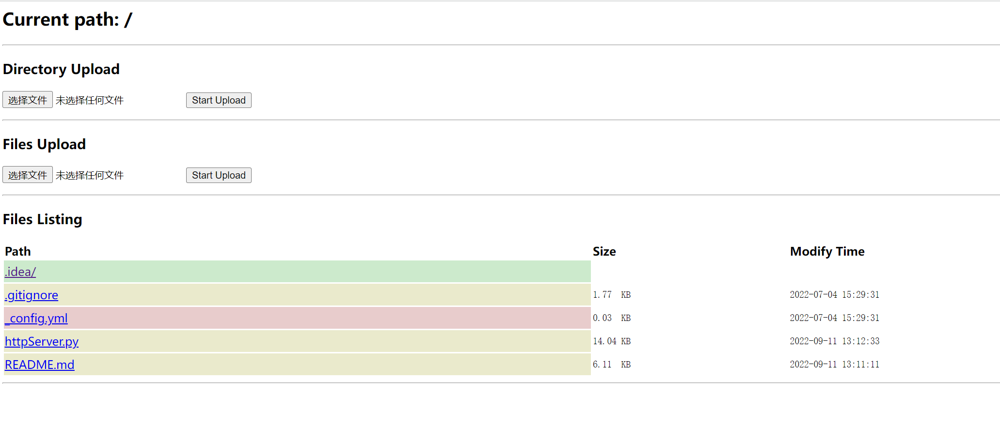

# HTTP_SERVER
实现http服务器，支持文件夹/文件上传和下载


## 简介
原仓库地址：GitHub仓库：[JevenM](https://github.com/JevenM/HTTP_SERVER)

本删除了原仓库中的一些个人用不到的功能（生成目录树？），另外稍微给页面加了一点格式，美化了一点点。

## 功能

1. 本地上传文件夹（单个文件夹，文件夹内部支持多级嵌套）
2. 本地上传文件
3. 展示文件目录，属性（文件路径，大小和最后修改时间）。其中文件夹以浅绿色标注；文件以淡黄色标注；链接文件以淡红色标注；

## 运行步骤：

- 查看帮助信息：

```shell
$ python httpServer.py -h
usage: httpServer.py [-h] [--path PATH] [--bind ADDRESS] [port]

positional arguments:
  port                  Specify alternate port [default: 8000]

options:
  -h, --help            show this help message and exit
  --path PATH           Specify the folder path
  --bind ADDRESS, -b ADDRESS
                        Specify alternate bind address [default: "0.0.0.0"]
```

 - 打开`Terminal/CMD`窗口，进入要共享的文件目录，注意使用`python3`运行代码：
```shell
python httpServer.py [port]
```
 - `[port]` 端口为可选参数，默认 8000。

### 本地测试启动

```shell
python httpServer.py 8000
```

 - 如果需要放在服务器运行，则使用远程连接工具登录到服务器控制台，需要使用`nohup`来支持关闭`shell`之后，让他保持后台运行，
 - 执行：
```shell
 nohup python3 httpServer.py >> HTTP_SERVER.log 2>&1 &
```
 - 这里我们将日志保存到`HTTP_SERVER.log`中，便于调试查看，优化程序。

`linux`服务器启动时，注意选择`python3`环境

## 效果图

请按照上述命令启动，打开浏览器输入`IP:port`即可。



## 上传

此模块包括上传（多个）文件和上传文件夹两种功能，针对不同的需求。
### 上传文件夹

点击`Directory Updating`下的`Choose Files`，在弹出窗口选择要上传的文件夹，点击`upload`，随后`chrome`浏览器会弹出页面，


再次点击`upload`，此处显示文件夹中的文件总数量


随后点击`uploadDir`，即可上传，成功页面如下


## 下载
找到需要的文件，直接点击文件进行下载（针对某些格式的文件，如果浏览器能直接解析，可能会直接在浏览器打开文件，因此针对这种类型的文件，使用右键另存为来下载它）

## 参考资料

 - 参考https://www.jianshu.com/p/2147b7e7cf38
 - 参考https://github.com/freelamb/simple_http_server
 - 参考https://blog.csdn.net/dirful/article/details/4374953
 - 参考https://blog.csdn.net/qq_35038500/article/details/87943004
